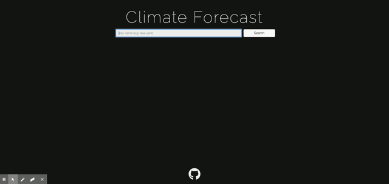

# Weather App
[](https://opensource.org/licenses)

[launch project](eaclumpkens.github.io/dayplanner/)

In this project I utilized Open Weather API to render current and near future climate data on the user's input of a city name. A search history is automatically updated and rendered, the most recently searched item being saved to local storage. On refresh, the previous session's last searched city is rendered.

### User-Story

AS someone who interacts with the climate everyday
I WANT to see forecast and relevant climate data for today and the near future
SO THAT I can dress and plan my week accordingly


## Table of Contents

[Installation](#installation)

[Usage](#usage)

[Contribution](#contribution)

[Tests](#tests)

[Images](#images)

[Questions](#questions)

----

<a name="installation"></a>

### Installation

`git clone` repository

<a name="usage"></a>

### Usage

```
GIVEN a weather dashboard with form inputs
WHEN I search for a city
THEN I am presented with current and future conditions for that city and that city is added to the search history
WHEN I view current weather conditions for that city
THEN I am presented with the city name, the date, an icon representation of weather conditions, the temperature, the humidity, the wind speed, and the UV index
WHEN I view the UV index
THEN I am presented with a color that indicates whether the conditions are favorable, moderate, or severe
WHEN I view future weather conditions for that city
THEN I am presented with a 5-day forecast that displays the date, an icon representation of weather conditions, the temperature, and the humidity
WHEN I click on a city in the search history
THEN I am again presented with current and future conditions for that city
WHEN I open the weather dashboard
THEN I am presented with the last searched city forecast
```
<a name="contribution"></a>

### Contribution

Single contribution project 

<a name="tests"></a>

### Tests

Currently no testing

<a name="images"></a>

### Images

##### Desktop Version


##### Mobile Version


----

<a name="questions"></a>

### Questions
##### Contact Me

Feel free to contact me via GitHub or email with any feedback - thanks for checking out my code!

[GitHub u/eaclumpkens](https://github.com/eaclumpkens)
eaclumpkens@gmail.com
